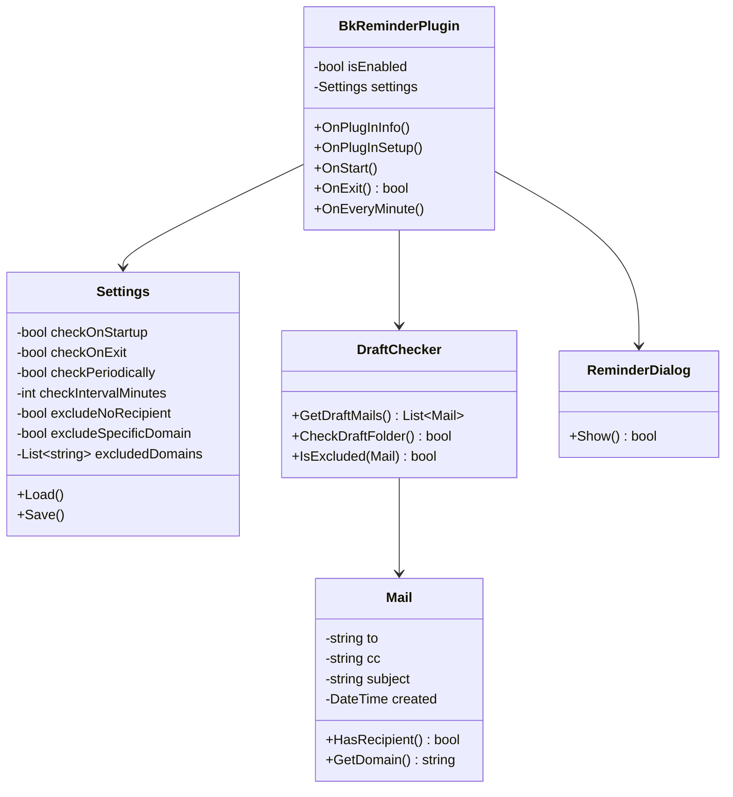

# BkReminder設計書

**最終更新日**: 2013/02/21  
**更新者**: tatsurou

---

## 使用時のイメージ

任意のメールフォルダにメールが残ったままBecky!を終了させようとした場合にリマインドする。（送信箱にメールが残っているときにBecky!の標準機能でポップアップが出るのと同じイメージ）

---

## UI設計

### リマインド時のポップアップ

- **タイトル**: 「Message from BkReminder」
- **メッセージ**:
  - 作成中のメッセージが草稿箱に残っています。このまま終了してよろしいですか？

### 設定画面

#### BkReminderを無効にする（チェックボックス）
- チェックボックスによりBkReminderプラグインを無効にするか有効にするかを設定する

#### 草稿メールの確認タイミング（グループ）

**Becky!の起動時（チェックボックス）**
- Becky!の起動時に確認をするか設定する

**Becky!の終了時（チェックボックス）**
- Becky!の終了時に確認をするか設定する

**一定周期**
- 指定された周期で確認をするか設定する
- 確認タイミングを分単位で設定できる

#### 確認対象から除外する条件

- **宛先（ToまたはCC）が指定されていないメール**
- **宛先（ToまたはCC）が特定ドメインであるメール**
  - 対象ドメイン（追加/削除可能）
  - 例：@docomo.ne.jp

---

## 機能要件

### プラグインを初期化する
- APIの`BKC_OnPlugInInfo`を使用

### 設定画面を表示し、設定を保存する
- APIの`BKC_OnPlugInSetup`を使用
- iniファイルの読み書き

### Becky!の起動時を取得
- APIの`BKC_OnStart`を使用

### Becky!の終了時を把握し、終了させるか指定する
- APIの`BKC_OnExit`を使用

### 一定周期で処理をする
- APIの`BKC_OnEveryMinute`で1分毎に処理をする

### 草稿箱にあるメール一覧を取得し、各メールのヘッダ情報を取得する
- ※草稿箱のインデックスファイルへのパスは以下:
  - `メールボックス名（XXXXXX.mb）¥!!!!Outbox¥!!!Draft¥Folder.idx`
- `GetCurrentMailBox`でメールボックス名を取得
- `Folder.idx`構造を読み取る

---

## データ形式

### 設定

設定の各項目のデータ形式をリストアップする。

- データ形式はフォーマット（文字列・数値・クラス）とデータサイズ（最小値・最大値）を記載する
- 設定の名前は具体的に記載する

### iniファイル / レジストリ / 独自ファイル

ファイルに保存する設定を記載する。

保存するファイルの形式と保存する際のデータ形式を具体的に記載する。ほぼ「データ形式-設定」と同じ内容になる。

---

## 実装方法

機能要件をどの関数やAPIを使って実装するかを記載する。ソースコードレベルで記載する必要はない。

---

## クラス構成

---

## テスト

プログラムの動作テストをする方法を記載する。

- テストによって判断できる機能を具体的に記載する
- テスト方法は手順を細かく具体的に記載する

---

## 更新履歴

設計に更新が必要となったら下記の例のように記載する。

### Yyyy/mm/dd
- XX機能をYY機能に変更する事となったため、機能要件を修正した
- ZZの設定を削除したためUI設計を修正した

---

## 付録

### Becky!のメールリマインド機能

- 指定時刻以後に巡回されたタイミングでリマインド箱から特定箱（受信箱や送信箱）へコピーする機能
- 巡回時にメールを送信する設定にする必要がある